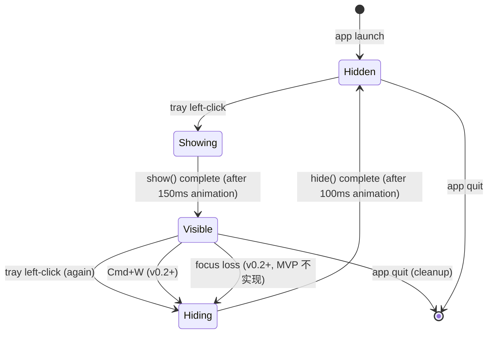

# Popup Window — Visual Design

> **Status:** v0.1 design freeze
> **Cross-ref:** [ux-design § 3](../../bmad/02-planning/ux-design.md), [user-stories H2](../../product/user-stories.md#h2--弹开列表分诊优先级)
> **Implementation:** [S-007](../../bmad/03-solutioning/epics/story-007-popup-window.md), [S-008](../../bmad/03-solutioning/epics/story-008-session-list-render.md)

---

## 1. 窗口框架（empty）

```
                              ┌──────────────────────────────────────┐
                              │  Claude Code Monitor       refresh   │  ← Header 40pt
                              ├──────────────────────────────────────┤
                              │                                       │
                              │                                       │
                              │                                       │
                              │       no claude sessions running     │
                              │                                       │
                              │  start a session with `claude` in    │
                              │            your terminal              │
                              │                                       │
                              │                                       │
                              │                                       │
                              └──────────────────────────────────────┘
                                            360pt wide
                                            200pt tall (min, empty state)
```

**Spec**：
- 宽度 360pt（固定）
- 高度 200pt（最小，empty state）→ 480pt（最大，多 session 滚动）
- 圆角 10pt（macOS Sonoma popover 风格）
- 背景 `windowBackgroundColor`（auto light/dark）
- 边框 1px `separatorColor`
- 阴影 系统默认 popover shadow

---

## 2. 多场景 mockup

### 2.1 3 session 场景（对应 [S1 典型周二](../../product/scenarios.md)）

```
┌──────────────────────────────────────────────┐
│  Claude Code Monitor              refresh    │
├──────────────────────────────────────────────┤
│                                              │
│  api-server-tests · ⬛waiting · just now    │
│  All 142 tests passed. Want me to commit... │
│                                              │
├──────────────────────────────────────────────┤
│                                              │
│  blog · ⬛working                            │
│  Reformatting headings to ATX style...      │
│                                              │
├──────────────────────────────────────────────┤
│                                              │
│  api-server · ⬛working                      │
│  Reading folder structure...                │
│                                              │
└──────────────────────────────────────────────┘

总高度 = 40 (header) + 3 × 54 (list items) ≈ 202pt
```

### 2.2 单 session（empty 后第一次有 session）

```
┌──────────────────────────────────────────────┐
│  Claude Code Monitor              refresh    │
├──────────────────────────────────────────────┤
│                                              │
│  my-project · ⬛working                      │
│  Reading folder structure...                │
│                                              │
│                                              │  ← 下方留白（窗口高度被
│                                              │     min-height: 200pt 撑住）
│                                              │
└──────────────────────────────────────────────┘

总高度规则：popup 高度 = max(min-height 200pt, header 40pt + 内容)
- 1-2 session 时：内容 < 160pt，下方留白
- 3 session 时：内容刚好 ≈ 162pt，几乎填满
- 4-8 session：内容自然增高至最多 480pt
- > 8 session：480pt 封顶，内部滚动
```

### 2.3 重负载（对应 [S2](../../product/scenarios.md)，8 session）

```
┌──────────────────────────────────────────────┐
│  Claude Code Monitor              refresh    │
├──────────────────────────────────────────────┤
│                                              │
│  archive · ⬛waiting · 8min                  │
│  Archived 14 posts. Listed paths.            │
│                                              │
├──────────────────────────────────────────────┤
│                                              │
│  changelog · ⬛waiting · 5min               │
│  156 deps analyzed. 12 breaking changes...  │
│                                              │
├──────────────────────────────────────────────┤
│                                              │
│  integration · ⬛waiting · 3min             │
│  Integration tests complete: 38 pass...     │
│                                              │
├──────────────────────────────────────────────┤
│                                              │
│  api-server-tests · ⬛waiting · 1min        │
│  Bug fixed, tests pass. Diff in commit...   │
│                                              │
├──────────────────────────────────────────────┤
│                                              │
│  docs · ⬛working                            │
│  ...                                         │
│                                              │ ▮     ← 滚动条 (右侧 auto-hide)
│  ━━━━━━━━━━━━━━━━━━━━━━━━━━━━━━━━━━━━━     │ ▯
│                                              │ ▯
│  blog · ⬛working                            │ ▯
│  Polishing conclusion now...                │ ░
│                                              │
└──────────────────────────────────────────────┘

总高度 = 480pt (max)
list 内容超过容器，进入滚动
默认按 waiting 时长降序排序（8min 在最上）
working 内部无显式排序
```

### 2.4 列表项展开（对应 [H3](../../product/user-stories.md#h3--不切走也能读到关键信息)）

```
┌──────────────────────────────────────────────┐
│  Claude Code Monitor              refresh    │
├──────────────────────────────────────────────┤
│                                              │
│  api-server-tests · ⬛waiting · just now    │  ← 点击该行展开
│  All 142 tests passed. Want me to commit... │
│  ┌────────────────────────────────────────┐ │
│  │                                        │ │
│  │ All 142 tests passed.                  │ │
│  │                                        │ │
│  │ Coverage: 87.3% (up from 84.1%)        │ │
│  │                                        │ │
│  │ [Bash] git diff --stat                 │ │  ← tool_use 简化展示
│  │                                        │ │
│  │ Want me to commit with message         │ │
│  │ 'fix: token validation edge case'?     │ │
│  │                                        │ │
│  └────────────────────────────────────────┘ │
│                                              │
├──────────────────────────────────────────────┤
│                                              │
│  blog · ⬛working                            │  ← 其他项保持 collapsed
│  Reformatting headings to ATX style...      │
│                                              │
└──────────────────────────────────────────────┘
```

**展开高度策略**：
- 内容 ≤ 200pt：popup 整体自适应增高（封顶 480pt）
- 内容 > 200pt：展开区域内部 scrollable

### 2.5 Unknown 状态 session（错误 path）

```
┌──────────────────────────────────────────────┐
│  Claude Code Monitor              refresh    │
├──────────────────────────────────────────────┤
│                                              │
│  api-server-tests · ⬛waiting · 1min        │  ← 正常
│  All 142 tests passed. Want me to commit... │
│                                              │
├──────────────────────────────────────────────┤
│                                              │
│  blog · ⬜unknown                            │  ← Unknown 状态
│  (unable to read transcript)                │
│                                              │
└──────────────────────────────────────────────┘

⬜ = 灰色 badge（vs ⬛ 表示有色 badge）
```

---

## 3. 窗口位置

### 3.1 MVP：webview window 默认位置

```
Screen:
┌─────────────────────────────────────────────────────┐
│ 🍎 ...                              CCM 3            │  ← menubar
│                                                      │
│                                                      │
│                  ┌─────────────────┐                │  ← Popup 在屏幕"上次"位置
│                  │  CCM popup      │                │     （macOS 自动记忆）
│                  │  ...            │                │     默认屏幕中央
│                  └─────────────────┘                │
│                                                      │
└─────────────────────────────────────────────────────┘
```

### 3.2 v0.2+：锚定到 tray icon 下方

```
Screen:
┌─────────────────────────────────────────────────────┐
│ 🍎 ...                              CCM 3            │  ← menubar
│                                  ┌─────────────────┐│  ← popup 锚定到
│                                  │  CCM popup      ││     tray icon 正下方
│                                  │  ...            ││     右对齐
│                                  └─────────────────┘│
│                                                      │
└─────────────────────────────────────────────────────┘
```

实现见 [ux-design § 3.2](../../bmad/02-planning/ux-design.md) + [addendum § A.2](../../bmad/02-planning/addendum.md)。

---

## 4. 显示 / 隐藏 animation 序列

详细 animation 见 [animations.md](animations.md)。简版：

### Show

```
T=0ms      T=75ms     T=150ms
┌─┐  →   ┌──────┐ → ┌──────────┐
│·│       │ ░░░░│   │ Header   │
└─┘       │ ░░░░│   │ ...      │
opacity:  └──────┘   └──────────┘
0,         opacity:   opacity: 1
scale 0.95 0.5        scale 1
           scale 0.97
```

150ms ease-out，fade + scale 0.95→1。

### Hide

```
T=0ms              T=100ms
┌──────────┐  →   (nothing)
│ ...      │      opacity 0
└──────────┘
opacity: 1
```

100ms ease-in，fade only。

---

## 5. 列表滚动行为

### 5.1 触发条件

- 内容总高度 > 容器高度（480pt - 40pt header = 440pt 可用）
- list item 高度约 54pt → 容器内可容纳约 **8 项**
- 超过 8 项进入滚动

### 5.2 滚动条样式

- macOS 默认（auto-hide）
- 鼠标 hover 列表区域时显示
- 离开 hover 自动 fade out
- 不引入自定义滚动条

### 5.3 展开项 + 滚动的交互

```
展开某项后 popup 容器最大 480pt：
- 如果展开后内容超过 440pt，展开区域内部 scroll
- 但 collapsed 状态的列表不一起 scroll（避免双层滚动）

策略：
- 展开内容 ≤ 200pt → popup 自适应增高
- 展开内容 > 200pt → 展开区域 internal scroll
- 列表项数 > 8 → 列表区域 scroll
- 同时满足：双区独立滚动
```

---

## 6. 窗口属性 spec

按 [ux-design § 3.2](../../bmad/02-planning/ux-design.md)：

| 属性 | 值 | 实现位置 |
|---|---|---|
| `width` | 360pt | `tauri.conf.json` |
| `height` | 480pt 起始（内容 < 此时自适应小） | `tauri.conf.json` + CSS |
| `decorations` | `false` (无标题栏) | `tauri.conf.json` |
| `resizable` | `false` | `tauri.conf.json` |
| `skipTaskbar` | `true` | `tauri.conf.json` |
| `alwaysOnTop` | `true` | `tauri.conf.json` |
| `visible` | `false` (启动时隐藏) | `tauri.conf.json` |
| `transparent` | `false` (实色背景) | `tauri.conf.json` |
| `shadow` | `true` (系统 popover shadow) | macOS default |

---

## 7. 显隐状态机



MVP **不实现** focus loss 自动 hide（[ux-design § 15 OQ-1](../../bmad/02-planning/ux-design.md)）。

---

## 8. 边界情况

### 8.1 用户在 popup show 动画期间再点 tray

**MVP 处理**：丢弃第二次点击（debounce by `is_visible()` check）。
**实现**：show() 调用前查 `window.is_visible()`，如果已经 true（即使在 animation 中）则忽略。

### 8.2 popup 显示时 macOS 自动锁屏

**已知行为**：锁屏后 webview window 自动 minimize / hide。解锁后 macOS 自己 restore。
**MVP 处理**：依赖 macOS 默认，不做特殊处理。

### 8.3 popup 显示时切到全屏 app

**已知行为**：alwaysOnTop=true 让 popup 仍可见。
**MVP 处理**：保持默认。如果干扰用户全屏体验，v0.2+ 加 "全屏时自动 hide" 选项。

### 8.4 popup 显示时收到 macOS 通知

**MVP**：通知自然弹在右上角，popup 不受影响（不会被遮挡因为 alwaysOnTop）。

---

## 9. Implementation checklist

实现 [S-007](../../bmad/03-solutioning/epics/story-007-popup-window.md) 时对照本文件：

- [ ] popup 360×480pt，圆角 10pt
- [ ] 启动时 hidden，左键 tray 显示，再左键 hide
- [ ] alwaysOnTop = true（全屏 app 时也可见）
- [ ] 无标题栏 / 不可缩放 / 不在任务栏
- [ ] 显示 < 200ms（含 150ms animation）
- [ ] light + dark mode 都正常
- [ ] 内容 < 200pt 时 popup 自适应小高度
- [ ] 8 项以上 list 启动滚动
- [ ] macOS 12 / 14 / 15 都实测
