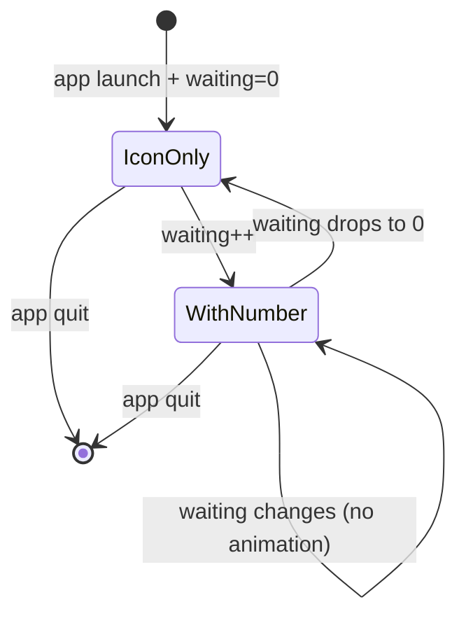

# Tray Icon — Visual Design

> **Status:** v0.1 design freeze
> **Cross-ref:** [ux-design § 2](../../bmad/02-planning/ux-design.md), [user-stories H1](../../product/user-stories.md#h1--瞄一眼判断是否切走)
> **Implementation:** [S-006](../../bmad/03-solutioning/epics/story-006-tray-icon-menu.md)

---

## 1. 总览

```
Menubar (macOS 顶部):
┌─────────────────────────────────────────────────────────────────┐
│ 🍎 Finder File Edit View ...    ⌚  📶 🔋  CCM 3  Q  🔍 ⓘ 🕐 │
│                                              ↑                   │
│                                       Claude Code Monitor        │
│                                       (icon + counter)            │
└─────────────────────────────────────────────────────────────────┘
```

我们的 tray icon 位置：macOS menubar 右侧，跟系统 + 其他 utility 共享。

---

## 2. 状态变体（mockup）

Menubar 的 row height 是 22pt（macOS 标准）。下面 ASCII 模拟实际 menubar 视觉。

**ASCII 约定**：用 `[icon]` 占位实际 PNG 图标——它是 template image，macOS 自动 light/dark 着色（light=黑色 / dark=白色），不能用 ASCII 字符精确表达。

### 2.1 Waiting = 0（仅图标）

```
Light mode (icon 显示为黑色):
   ┌────────┐
   │ [icon] │
   └────────┘

Dark mode (同 icon 自动反白为白色):
   ┌────────┐
   │ [icon] │
   └────────┘

字段渲染：
- 图标：32×32 PNG template image (macOS auto-tint)
- 数字：不显示
- 总宽度：约 22pt
```

### 2.2 Waiting = 1（图标 + 单位数字）

```
   ┌──────────┐
   │ [icon] 1 │     ← 图标 + 4px 间距 + "1"
   └──────────┘

字段：
- 图标：22pt（template，跟随 light/dark 自动）
- 间距：4px
- 数字：SF Pro Text Regular 13pt，labelColor（自动 light/dark）
- 总宽度：约 36pt
```

### 2.3 Waiting = 3（典型多数字）

```
   ┌──────────┐
   │ [icon] 3 │
   └──────────┘
```

跟 2.2 一致，仅数字不同。

### 2.4 Waiting = 12（双位数）

```
   ┌────────────┐
   │ [icon] 12  │     ← 双位数仍单字符宽度，整体扩到 ~42pt
   └────────────┘
```

### 2.5 Waiting = 99+（极端值）

```
   ┌──────────────┐
   │ [icon] 99+   │     ← 100+ session 不实际，但 UI 要 handle 不破
   └──────────────┘
```

**规则**：`waiting >= 100` 时显示 `"99+"`。极少触发但写在 spec 防 overflow。

### 2.6 App 进程死亡（tray icon 消失）

```
Menubar:
┌─────────────────────────────────────────────────────────────────┐
│ 🍎 Finder ... 📶 🔋     Q  🔍 ⓘ 🕐 │  ← CCM 图标不在了
└─────────────────────────────────────────────────────────────────┘

用户感知信号：菜单栏右侧少了一个图标
对应：[F3 app 自崩](../../product/user-stories.md#f3--app-自己崩了)
```

---

## 3. State machine（视觉态切换）



**关键约束**（来自 [P1 不打扰](../../bmad/02-planning/ux-design.md)）：

- 数字变化（1→2 或 3→0）**无 fade/scale/slide 动效**
- icon 永远不变色（不要"有 waiting 变红"之类）
- 不闪烁、不脉冲、不抖动

---

## 4. Sizing & spec table

| 元素 | 尺寸 / 字体 | 颜色（CSS-equivalent） | 备注 |
|---|---|---|---|
| Icon raster | 32×32 px @1x, 64×64 @2x | template (黑色 + alpha) → macOS auto tint | PNG, RGBA |
| Icon visual size in menubar | 22pt (macOS scales) | 跟 menubar 文字颜色一致 | system-controlled |
| Number font | SF Pro Text Regular 13pt | `labelColor` | 跟 menubar 系统文字一致 |
| Icon → number spacing | 4px | — | hard-coded |
| Number max char width | "99+" ≈ 3 chars | — | 不预留更宽空间 |
| Total tray item width | 22 (icon) + 4 (gap) + 0-24 (text) = 22-50pt | — | 动态 |

---

## 5. Icon visual design

### 5.1 MVP placeholder

文件：`src-tauri/icons/icon.png`（已生成）

```
   ●      ← 实心圆点
  ╱ ╲     
  ╲ ╱     
   ●      ← 直径约 20px，居中
```

- 实现：Python script 生成 32×32 PNG，alpha 边缘抗锯齿
- 黑色 + alpha，macOS 自动 light/dark mode 翻色
- **不是最终视觉**，仅为 MVP 占位

### 5.2 v1.0 候选方向（待设计师定）

| 方向 | 含义 | 评估 |
|---|---|---|
| **眼睛轮廓** | "watching" / "monitor" 隐喻 | 直观但太常见，跟 surveillance app 撞 |
| **监视器轮廓** | 直白 "monitor" | 工程师 friendly 但视觉无趣 |
| **圆形带切口** | 半月 / 半圆 - 像"状态指示" | 抽象但 distinctive，类似 ChatGPT logo 风格 |
| **小箭头 + 圆点** | "等你回复" 隐喻 | 太具象，多 session 时不通用 |
| **数字框** | "队列里有 N 个" | 跟 counter 数字重复 |

**推荐**：圆形带切口 + 黑色 template。**作者待办**：v1.0 release 前找设计师定稿。

---

## 6. Edge cases

### 6.1 Menubar 空间不够（系统挤压）

macOS 默认会从右往左隐藏 menubar items 当空间不够（比如 notch 占用）。我们的 icon 会被隐藏。

**MVP 处理**：不处理（依赖 macOS 自己），用户可以装 Bartender 之类管理。

### 6.2 不同 macOS 版本的 menubar item 渲染

| macOS | tray item 风格 |
|---|---|
| 12 (Monterey) | 标准 NSStatusItem，无变化 |
| 13 (Ventura) | 同上 |
| 14 (Sonoma) | Stage Manager 时 menubar 行为可能不同 |
| 15 (Sequoia) | 加强了 menubar item 信息密度，我们 icon 仍正常 |

**作者待办**：各版本实测一次截图。

### 6.3 全屏 app 时

macOS 全屏 app 会隐藏 menubar（自动隐藏模式）。我们 tray icon 此时**不可见**，但 app 仍在跑。

→ 用户退出全屏即可看到 tray icon 恢复。MVP 不做特殊处理。

### 6.4 多 monitor

- macOS 决定 menubar 在哪个 monitor（默认主 monitor）
- tray icon 跟随
- 我们不干涉

### 6.5 用户在做屏幕共享

⚠️ tray icon + 数字可见但**信息含量极低**（只是个数字），无敏感性。
但 popup 一旦打开会暴露 last_message——这是 [A1 user story](../../product/user-stories.md#a1--演示屏幕--zoom-共享时) 的 v0.2+ 待解决问题。

---

## 7. Implementation checklist

实现 [S-006](../../bmad/03-solutioning/epics/story-006-tray-icon-menu.md) 时对照本文件：

- [ ] Tray icon 出现在 menubar（位置由 macOS 控制）
- [ ] Light mode 下黑色，dark mode 下白色（auto）
- [ ] `icon_as_template(true)` 设置正确
- [ ] waiting=0 时仅图标，无数字
- [ ] waiting=1-99 时显示数字
- [ ] waiting≥100 时显示 "99+"
- [ ] 数字字体 SF Pro Text 13pt（跟 menubar 系统文字一致）
- [ ] 数字变化**无任何 animation**
- [ ] 颜色变化**无任何 animation**（永远 labelColor）
- [ ] icon 跟 number 之间 4px 间距
- [ ] 实测 macOS 12 / 14 / 15

---

## 8. CSS / Code skeleton

Tray icon 是 native（不是 webview），由 Rust + Tauri tray API 控制。前端 CSS 不参与。代码 skeleton 见 [S-006](../../bmad/03-solutioning/epics/story-006-tray-icon-menu.md) + [UML 06 Startup](../uml/06-sequence-startup.md)：

```rust
TrayIconBuilder::with_id("main")
    .icon(app.default_window_icon().unwrap().clone())
    .icon_as_template(true)   // ← key: 让 macOS 自动 light/dark 着色
    .menu_on_left_click(false) // 左键给 popup，不弹 menu
    .menu(&right_click_menu)   // 右键弹 Quit menu
    .build(app)?
```

更新 title（在 `list_sessions` 末尾）：

```rust
let waiting_count = sessions.iter().filter(|s| s.status == SessionStatus::Waiting).count();
let title = match waiting_count {
    0 => "".to_string(),
    n if n < 100 => format!("{}", n),
    _ => "99+".to_string(),
};
app.tray_by_id("main").map(|t| t.set_title(Some(title)));
```
