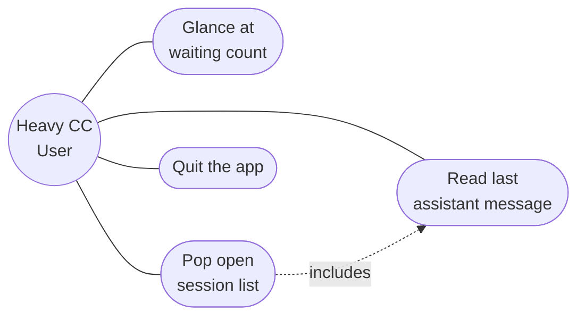

# Use Case Diagram

## 这张图回答

谁用这个工具？他们能做什么？

## 图

## 关键点

- **只有一个 actor**：重度 Claude Code 用户（并行 ≥3 个 session 是常态）。MVP 不考虑团队/协作场景。
- **uc1 是最高频用例**：用户大部分时间只扫一眼，不点开。tray icon 的视觉设计为此优化（数字要够大、对比度够高）。
- **uc2 includes uc3**：弹开列表后看到具体哪个 session 的最后一条，是这次交互的核心价值。"切走到对应终端"不算用例——那是用户用 Cmd+Tab / Mission Control 自己完成的，本 app 不参与。
- **没有 "switch to terminal tab" 用例**：MVP 显式砍掉，理由见产品定义 v0.2。

## 取舍

把"管理 session 备注/标签/分组"这类典型 utility 用例砍了——MVP 只服务"被动感知"这一个核心场景。多一个用例就多一份维护负担，开源项目尤其要忍住。
