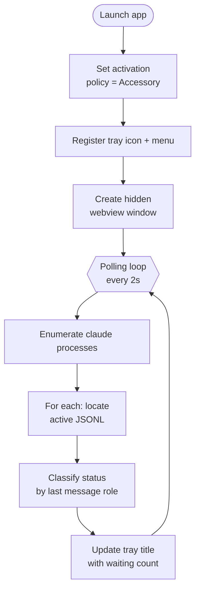

# Activity Diagram — 端到端使用流程

## 这张图回答

从启动 app 到用户看完一次状态再回到工作，整条路径上发生了什么？

## 图

### App 侧（后台持续运行）



### User 侧（异步发生）

```mermaid
flowchart TD
  work[User working in<br/>terminal A] --> glance{Glance at<br/>menubar}
  glance --> seeNumber{Waiting > 0?}
  seeNumber -- no --> work
  seeNumber -- yes --> click[Click tray icon]
  click --> popup[Webview popup shown]
  popup --> read[Read session list +<br/>last messages]
  read --> decide{Need to act?}
  decide -- yes --> switch[Cmd+Tab to that terminal<br/>externally]
  decide -- no --> dismiss[Click outside]
  switch --> dismiss
  dismiss --> work
```

## 关键点

- **两条流程是异步、解耦的**：app 的轮询循环跟用户行为完全独立。这是"被动感知"产品形态的核心——app 永远不主动打断用户。
- **轮询频率 2s 是个起点**：CPU 占用可接受、状态延迟<2s 用户也无感。MVP 写死，不做配置。
- **"switch to terminal" 是 app 外的动作**：本 app 不接管这一步。

## 取舍

没画 swimlane（Mermaid 不原生支持）。用两张并列流程图替代，语义足够。如果以后切到 PlantUML，可以合成一张带泳道的图。
