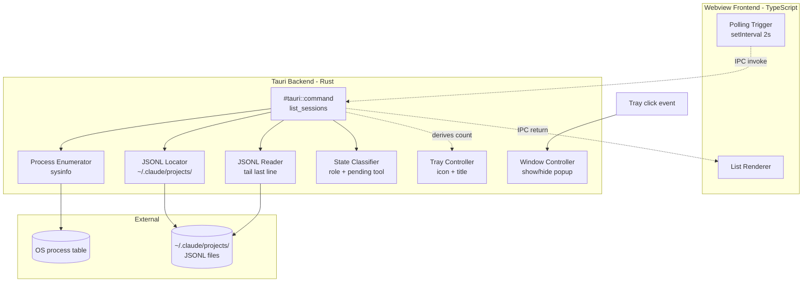

# Component Diagram

## 这张图回答

系统由哪些模块组成？跨语言/跨进程的边界在哪？谁依赖谁？

## 图

## 关键点

- **IPC 是唯一跨语言边界**：前端调用 `invoke("list_sessions")`，后端通过 `#[tauri::command]` 接收。所有数据用 serde 序列化。
- **Process Enumerator / JSONL Reader / State Classifier 是三个独立职责**：单元测试可以分别 mock。MVP 阶段它们都塞在 `session.rs` 一个文件，后续按需拆分。
- **Tray Controller 和 Window Controller 不响应前端 invoke**：它们响应 Tauri 自己的 tray event 回调，是完全独立的事件路径。
- **没有数据库、没有网络**：只读本地 FS 和 OS 进程表。这是为什么这个 app 不需要任何权限申请（除了首次打开时 macOS 例行的"未识别开发者"确认）。

## 取舍

没画 Webview runtime 本身（macOS 用 WKWebView）——那是 Tauri 的实现细节，不属于本项目模块。
