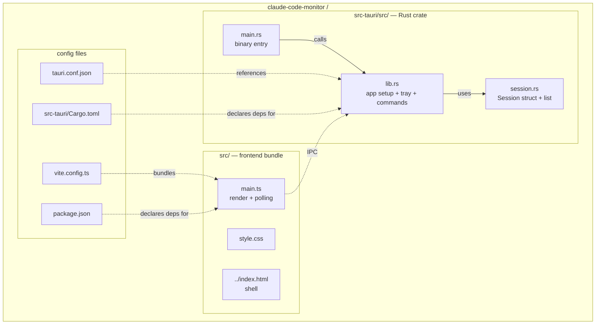

# Package Diagram

## 这张图回答

代码文件是怎么组织的？编译时哪些模块依赖哪些？

## 图



## 关键点

- **后端是单 crate**：`main.rs` 是 thin binary entry，所有逻辑在 `lib.rs` + 子模块。这样将来可以 `cargo test` 直接测 lib 部分，binary 只负责入口。
- **前端无框架**：单 `main.ts` + 一份 CSS。MVP 阶段引入框架（React/Vue/Svelte）会让 bundle 体积翻倍而 UI 不复杂——一个列表 + 一个 header。
- **配置文件多但稳定**：一次配好基本不再动。

## 后续可能拆分

随着 `session.rs` 变大，会按职责拆：

```
session/
  mod.rs       — Session struct + 编排
  process.rs   — 进程枚举
  jsonl.rs     — JSONL 定位 + 解析
  classify.rs  — 状态判定
```

MVP 阶段先合一起，避免过度设计。
