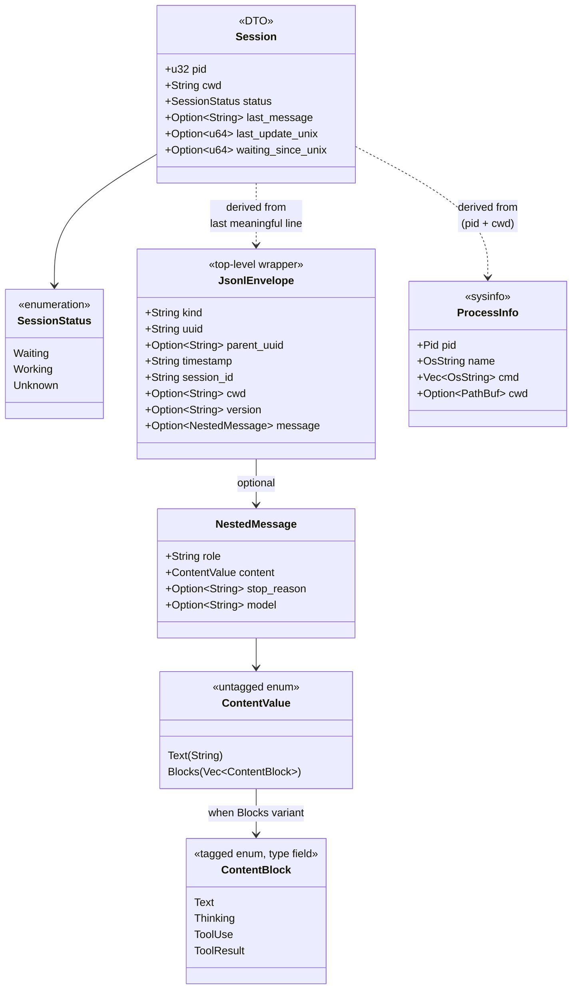

# Class Diagram

## 这张图回答

核心数据结构有哪些？它们的字段、关系和派生方式是什么？

> **2026-05-18 更新**：JSONL 相关类按 [spec/jsonl-schema.md](../../spec/jsonl-schema.md) 实测 schema 重画。之前 JsonlMessage 是顶层假设，实际是 envelope + nested message 两层。

## 图

## 关键点

- **Session 是面向前端的 DTO**：通过 serde 序列化为 JSON 传给 webview。字段保持扁平、对 TS 友好（用 snake_case，前端 interface 镜像）。
- **JsonlEnvelope 是顶层 wrapper**：每行 JSONL 都有这个外壳。`kind` 字段（实际 JSON 是 `"type"`）决定它是 user / assistant / attachment / file-history-snapshot / etc。
- **NestedMessage 在 envelope.message 里**：仅在 kind=user/assistant 时存在。`role` + `content` + `stop_reason` 在这。
- **ContentValue 是 untagged enum**：user 输入是 string（自然字符串），assistant content + user tool_result wrapper 是 array。serde `#[serde(untagged)]` 自动 dispatch。
- **JsonlEnvelope / NestedMessage / ContentValue / ContentBlock 都是内部解析中间结构**：不暴露给前端。
- **跟 ProcessInfo 是 dependency 不是 composition**：sysinfo 的 ProcessInfo 用完就丢，Session 只保留派生出来的 pid + cwd。

## SessionStatus 派生规则（核心业务逻辑）

详见 [UML 09 State Machine](09-state-session.md) + [spec/jsonl-schema.md § 6](../../spec/jsonl-schema.md)：

| 输入（last meaningful envelope，反扫跳过非 user/assistant） | 输出 |
|---|---|
| `None`（JSONL 读不到 / parse 失败 / 全是非 user/assistant） | `Unknown` |
| `envelope.kind == "assistant"` AND `message.stop_reason == "end_turn"` | `Waiting` |
| `envelope.kind == "assistant"` 其他 `stop_reason` (`tool_use` / `max_tokens` / etc) | `Working` |
| `envelope.kind == "user"`（含 tool_result wrapper） | `Working` |

## 命名约定

- Rust 内部用 `snake_case`，对外（serde）保持 snake_case 与前端对齐。
- JSONL envelope 顶层字段（如 `type` / `parentUuid` / `sessionId` / `gitBranch`）用 serde `#[serde(rename = "...")]` 处理 — JSONL 是 camelCase 我们 Rust 是 snake_case。
- TS interface 镜像 Rust struct，手写维护。MVP 阶段不引入 `ts-rs` 自动生成——schema 还在变，自动化收益<手写维护成本。
