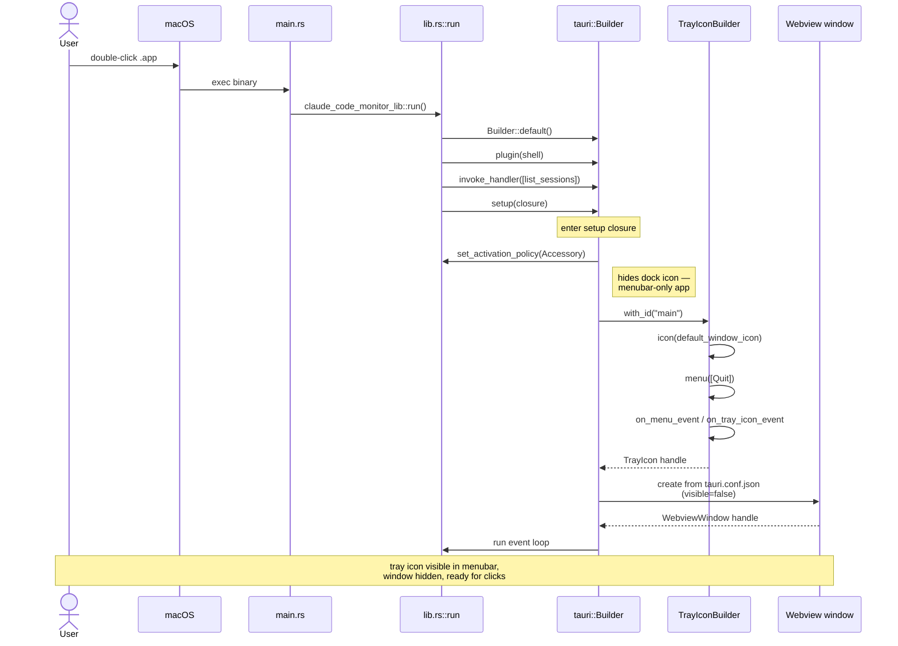

# Sequence Diagram — Startup

## 这张图回答

用户双击 ClaudeCodeMonitor.app 后，到 tray icon 出现在菜单栏之间，发生了什么？

## 图

## 关键点

- **setup closure 是一次性的**：所有初始化在这里完成。之后只剩事件循环。
- **Activation Policy = Accessory**：macOS 特有，让 app 不在 Dock 显示、不在 Cmd+Tab 切换器里。menubar-only app 的标配。
- **Webview window 是预创建 + 隐藏**：不是每次点击 tray 才新建。首次点击只是 `show()`，几乎零延迟。
- **`default_window_icon` 是 placeholder**：MVP 阶段用 32×32 黑色圆点，正式发布前换。

## 失败路径（未在图中）

- 如果 setup 闭包 panic（比如 tray 初始化失败），app 直接退出。MVP 不做 graceful recovery——出问题就是 bug，不是 runtime case。
- 如果用户禁用了 webview（极少见的 macOS 限制），window 创建会失败，app 仍能跑但点击 tray 无响应。
