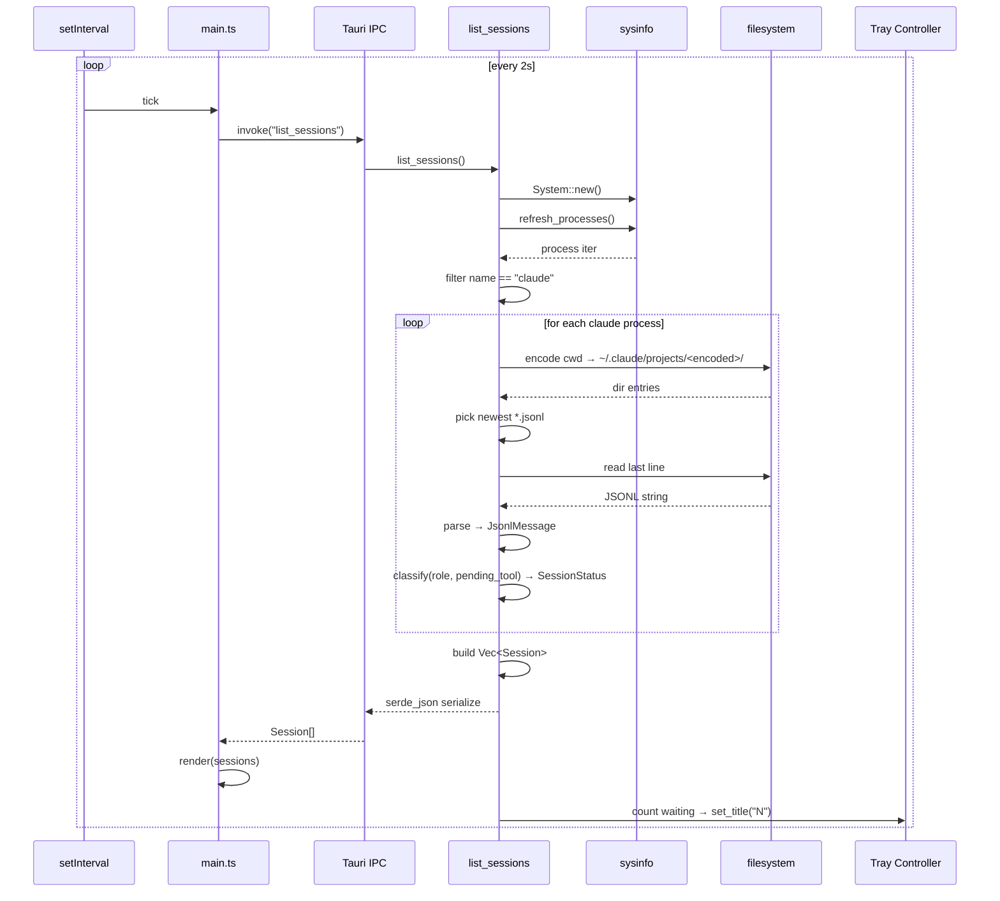

# Sequence Diagram — Refresh Cycle

## 这张图回答

每 2 秒一次的状态刷新，前后端之间是怎么协作的？数据怎么流的？

## 图

## 关键点

- **触发器在前端（setInterval）**：选 setInterval 而不是后端定时器是因为——前端 polling 简单可控，并且天然跟 webview 可见性绑定（窗口隐藏时仍然轮询，未来想"窗口隐藏降低频率"也好改）。
- **整个 invoke 是阻塞的**：前端 await 期间不重渲染。但 `list_sessions` 在典型机器上 < 50ms（10 个 session 内），用户感知不到。
- **tray title 更新走的是 Cmd 末尾的 side effect**：不是单独一次 IPC。这样保证"前端看到的列表"和"tray 上的数字"永远一致。
- **JSONL 读最后一行**：MVP 用朴素 "从尾往前扫到 `\n`" 的方式，不维护文件 offset cache。对几 MB 的 JSONL 仍然 < 10ms。

## 已知优化空间（MVP 不做）

- 用 fs watcher（notify crate）替代轮询 — 复杂度高，且 macOS 上对 JSONL append 的事件投递有 quirk（合并、丢失）。等 v0.2。
- 后端长连 + push 模式（`emit_event`）— 前端 pull 简单，调试容易，MVP 够用。
- cwd → encoded path 的转换缓存 — 每次 refresh 重算，但只在毫秒级耽误，不优化。
