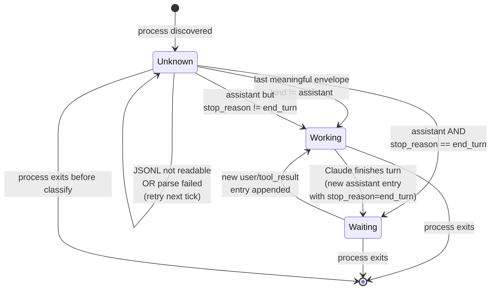

# State Machine Diagram — Session

## 这张图回答

单个 session 在它的生命周期里有哪些状态？什么事件触发状态迁移？

> **2026-05-18 实测更新**：基于 [spec/jsonl-schema.md](../../spec/jsonl-schema.md)，状态机更新：
> - 必须先 filter `type ∈ {user, assistant}`（跳过 attachment / file-history-snapshot / 等 envelope）
> - 判 Waiting 用 `message.stop_reason == "end_turn"`（比"无 pending tool_use" 更准）

## 图



## 关键点

- **状态属于 Session 不属于 process**：进程退出，Session 从列表里消失（终态 `[*]`）。MVP 不保留历史。
- **Unknown 是 transient**：进程刚被发现时（首次 refresh tick），可能 JSONL 还没创建或者读失败。下一轮 refresh 大概率分类成 Working/Waiting。
- **必须 filter envelope type**：JSONL 末尾可能是 `attachment` / `file-history-snapshot` / `ai-title` / `last-prompt` / `permission-mode` 等非 user/assistant entry，分类时反向扫跳过这些。
- **`stop_reason == "end_turn"` 是 Waiting 唯一信号**：assistant 的 `stop_reason` 是 official 状态，比之前文档假设的"无 pending tool_use" 启发式更准。
- **Working ↔ Waiting 是双向、无状态**：每一轮 refresh 重新分类，不依赖之前的状态。分类逻辑必须是 pure function——只看当前 JSONL 最后一条有意义的 envelope。这是为什么 MVP 选 polling 而不是 event-driven：polling 天然 idempotent。
- **没有 Stopped / Paused 状态**：Claude Code 本身没有"暂停"概念。进程在就是在，不在就是不在。

## 分类逻辑伪代码

跟 [data-model.md § 2.5](../../bmad/03-solutioning/data-model.md) + [spec/jsonl-schema.md § 6](../../spec/jsonl-schema.md) 一致。

```rust
/// 反向扫，找最后一条 type ∈ {user, assistant} 的 envelope
fn last_meaningful(lines: &[String]) -> Option<JsonlEnvelope> {
    for line in lines.iter().rev() {
        let env: JsonlEnvelope = serde_json::from_str(line).ok()?;
        if env.kind == "user" || env.kind == "assistant" {
            return Some(env);
        }
        // 跳过 attachment / file-history-snapshot / permission-mode / ai-title / last-prompt
    }
    None
}

fn classify(env: Option<JsonlEnvelope>) -> SessionStatus {
    let env = match env {
        None => return SessionStatus::Unknown,
        Some(e) => e,
    };
    if env.kind != "assistant" {
        return SessionStatus::Working;   // user 或 user(tool_result wrapper)
    }
    let stop = env.message.as_ref().and_then(|m| m.stop_reason.as_deref());
    match stop {
        Some("end_turn") => SessionStatus::Waiting,
        _ => SessionStatus::Working,     // tool_use / max_tokens / null / etc
    }
}
```

## 边界情况

- **JSONL 刚被截断 / 损坏**：parse 失败 → `Unknown`。下一轮重试。
- **末尾全是非 user/assistant entry**：`last_meaningful` 返回 `None` → `Unknown`。这种情况实测见过——session 末尾常有 `attachment` (task_reminder)、`ai-title`、`last-prompt`。如果反向扫到文件头都没找到 user/assistant，标 Unknown。
- **assistant 消息 `stop_reason=tool_use`**：算 `Working`（在等 tool 执行或在等用户批准 tool）。从用户视角，这"算不算等我"取决于工具是 auto-approved 还是需要按 Y——MVP 一律算 Working，因为 Claude Code 在 prompt 等输入时 UI 上不区分 "tool approval prompt" 和 "next message prompt"。**这个判定后续需要 review 实际 transcript 校准。**
- **同一 cwd 下多个 JSONL**：选 mtime 最新的那个作为当前活跃 session 的 transcript。
- **session 内 `cwd` 字段变化**（用户在 session 内 cd 到子目录）：JSONL 文件路径仍由 session 启动时 cwd 决定（不会 mv）。但**进程的 cwd 不一定跟 session 启动时 cwd 一致** —— [S-002 实施时要 verify](../../bmad/03-solutioning/epics/story-002-jsonl-locator.md)。
