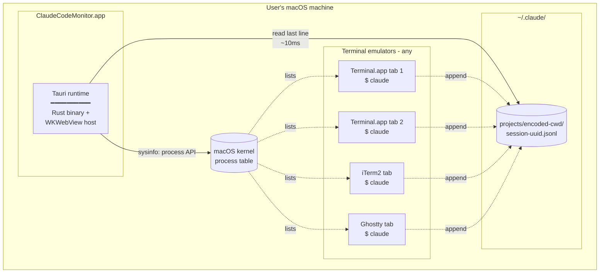

# Deployment Diagram

## 这张图回答

这个系统部署在哪？跟用户机器上其他进程/文件的物理关系是怎样的？

## 图

## 关键点

- **App 跟 claude 进程不通信**：它们之间没有 socket / pipe / shared memory。app 只是观察者：枚举进程 + 读它们写的 JSONL。
- **跨终端 emulator 中立**：因为只看 OS 进程表 + 文件系统，所以 Terminal.app / iTerm / Ghostty / Warp / Alacritty 全部都能监控，**无需为任何终端做适配**——这是砍掉"跳转到对应 tab"功能换来的最大架构红利。
- **完全本地**：没有外联，没有 daemon，没有 helper 进程。一个 .app，结束。
- **文件系统是 single source of truth**：app 进程崩了，重启就能恢复全部状态，因为状态全在 JSONL 里。

## 安装方式（未来）

- DMG 分发（`npm run tauri:build` 输出 → `src-tauri/target/release/bundle/dmg/`）
- Homebrew cask（待加 formula）
- 不需要后台 daemon、不需要 launchd、不需要权限申请（不读敏感目录、不访问网络、不操作其他进程）

## 不在此图

- CI/CD（GitHub Actions for release builds）— 那是开发部署，不是用户部署。
- 用户的 IDE / 编辑器 — 跟本系统完全无关。
